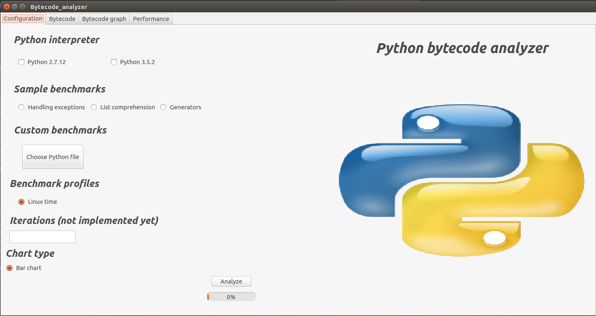
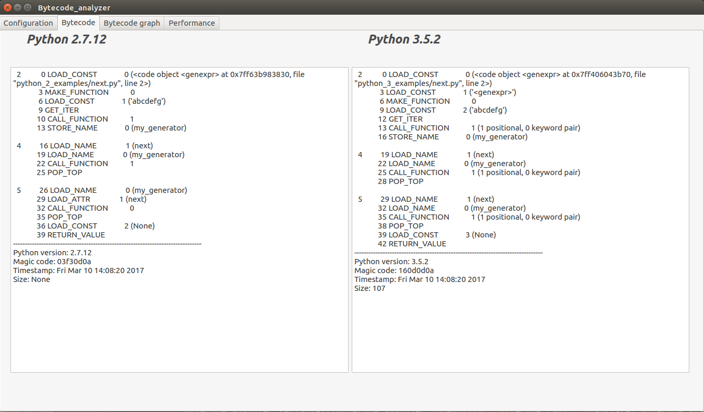
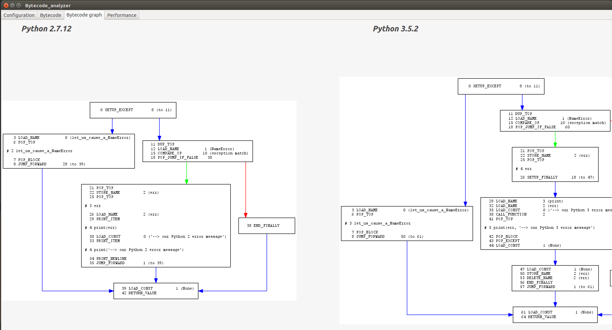

# bytecode_analyzer

PyQt4 GUI Python 2.7.12 and 3.5.2 bytecode analyzer

Application was tested on Ubuntu 16.04 LTS system; 

### Prerequisites

Following libraries are needed in order to launch bytecode analyzer(requirements.txt):
```
sudo apt-get install python-qt4
sudo apt install python-pydot python-pydot-ng graphviz
sudo apt-get install python-pygal
pip install tinycss
pip install cssselect
```

## Built With

* [PyQT4](https://www.riverbankcomputing.com/software/pyqt/download) - GUI
* [bytecode_graph](https://github.com/fireeye/flare-bytecode_graph) - Flare bytecode graph
* [Pygal](http://pygal.org/en/stable/) - Python SVG graph plotting library 


## Screenshots




